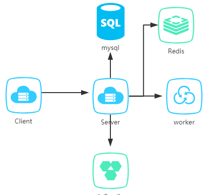
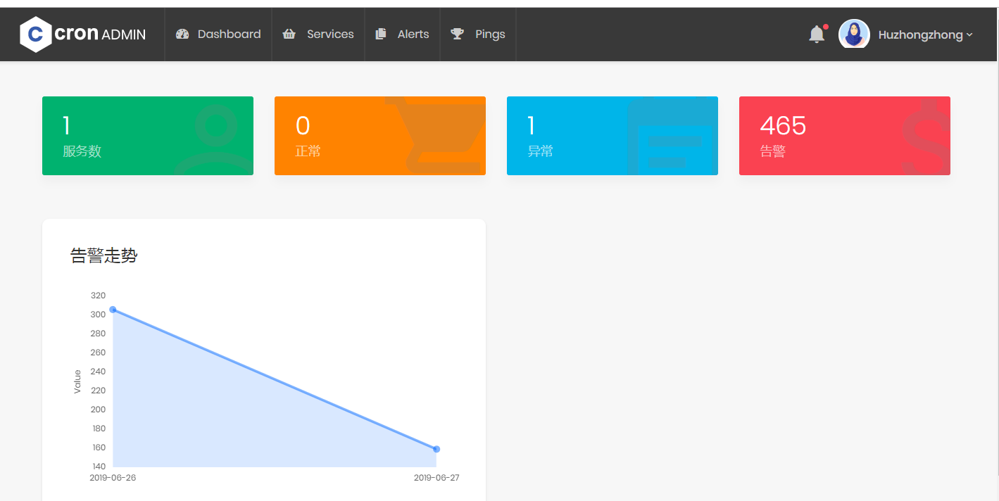
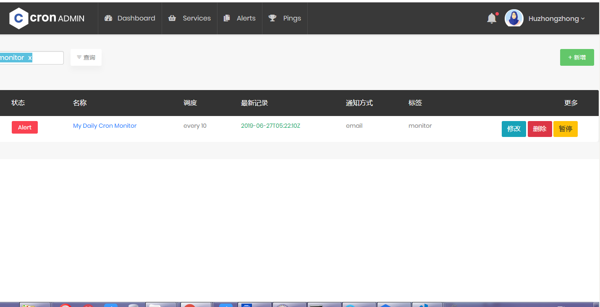
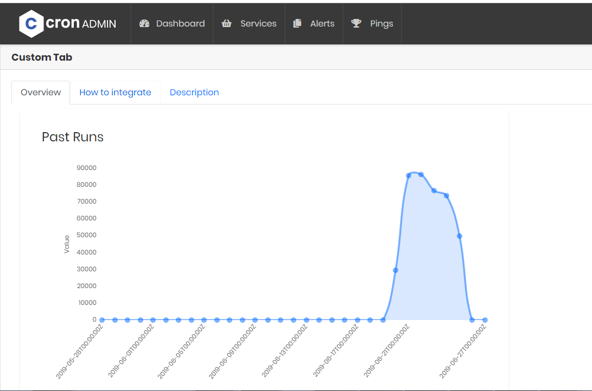
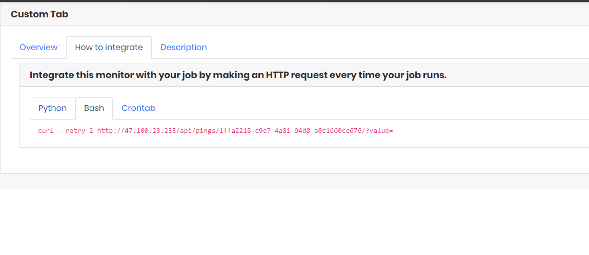
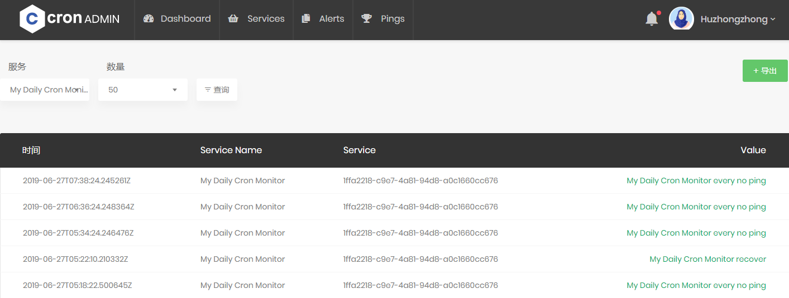
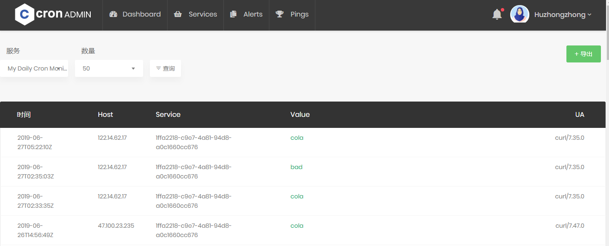
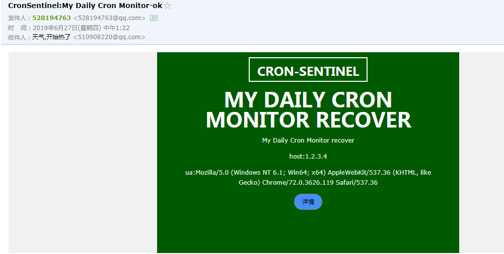
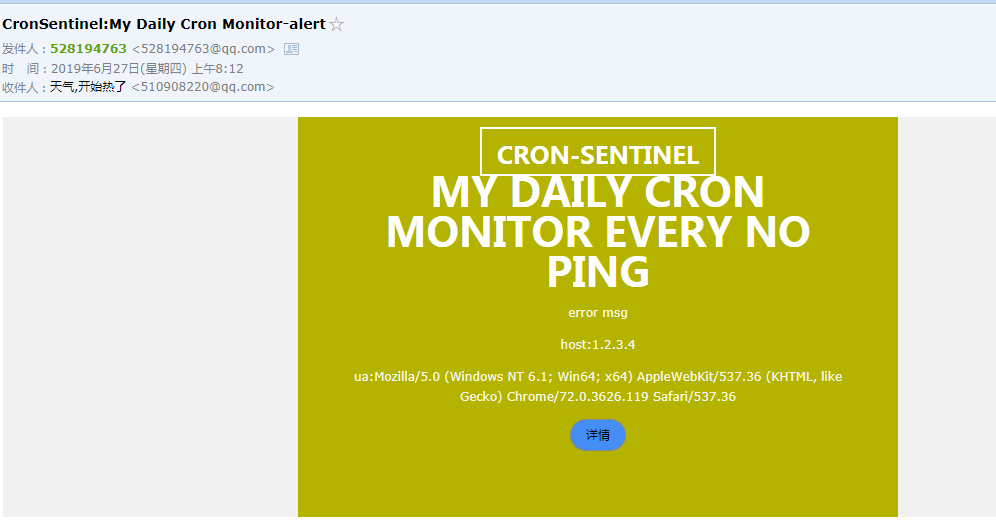

# cron-sentinel
is  a tool to monitor your scheduled jobs (or cron jobs).   简言之,就是被监控服务通过定时发送请求到服务端来表示服务正常与否.

## 架构图



- infuxdb: 存储上报上来的数据
- worker: 执行一些后台任务
- redis: 消息队列,huey会使用
- mysql: 存储服务、告警信息等

## 部署

#### docker方式

1. `docker-compose build  `构建镜像
2. `docker-compose run --rm djangoapp /bin/bash -c "cd sentinel; ./manage.py makemigrations;./manage.py migrate"`应用数据库差异
3. `docker-compose run djangoapp sentinel/manage.py collectstatic --no-input`生成资源
4. 创建`influxdb`
   - `docker-compose exec  influxdb influx -precision rfc3339`
   - 创建一个`30`天的策略:`create retention policy "30_days" on "sentinel" duration 30d replication 1 default`

## 演示

#### 首页



#### 服务







#### 告警



#### Ping



#### 通知






## Demo

1. http://47.100.23.235

2. 在服务页面,点击`新增`:

   - schedule: 
     - at:表示每天几点应该收到请求，比如每天晚上7点执行备份,可以在value写成19:00
     - every:表示每隔多久应该收到请求，比如每30分钟执行一次磁盘清理,可以在value写30
   - value:根据schedule有不同的值
   - grace:就是一个宽限期,如果没30分钟执行一次,服务本身执行时间可能需要花费2分钟.那么这个值可以写成3
   - alert_interval_min:如果服务端一直没收到客户端请求,为了避免一直告警,这里设置N分钟内置告警一次.
   - 通知: 邮件,微信,短信
   - name:服务名称
   - tags:标签,方面搜索
   - description:描述

   3.点击服务进去,切换到选项卡`How to integrate`,比如我要在python脚本里调用. 如下:

   ```python
   import requests;requests.get("http://47.100.23.235/api/pings/1ffa2218-c9e7-4a81-94d8-a0c1660cc676/?value=")
   ```

   这里说明一下,有两种错误:

   1. 长时间未上报信息给服务端
   2. `value=xxx`,xxx可以表示一种错误

   这两种都会触发告警通知.

## 结尾

目前服务我在阿里云部署了一个,谁需要监控一些服务可以加我微信,我会把需要ping的url发给你的,帮你监控需要的服务.


## 代办
1. 前端资源文件加载优化，去掉不用的

## 参考

- http://pawamoy.github.io/2018/02/01/docker-compose-django-postgres-nginx.html
- https://cronhub.io/

